<div align="center">


### ⚡ **Fast Learning for Accurate Scene Hashing**

*High-performance Neural Radiance Fields with Instant-NGP*

[](https://www.python.org/downloads/)
[](https://pytorch.org/)
[](LICENSE)

[Features](#-features) • [Installation](#-quick-start) • [Usage](#-usage) • [Documentation](#-documentation) • [Results](#-results)

---

</div>

## 🎯 What is FLASH?

FLASH is an **experimental implementation** of Instant-NGP for Neural Radiance Fields (NeRF). A learning project exploring how to train 3D scenes from 2D images in **10-15 minutes** on a single GPU — much faster than vanilla NeRF.

> **Note:** This is a research and learning project. While functional, it's still under development as I continue learning and improving it.

<div align="center">


</div>

## ✨ Features

<div align="center">


</div>

## 🚀 Quick Start

### Prerequisites

```bash
# Python 3.8+ required
python --version

# CUDA-enabled GPU recommended (works on CPU too)
nvidia-smi
```

### Installation

```bash
# Clone the repository
git clone https://github.com/inanxr/FLASH.git
cd FLASH

# Install dependencies
pip install -r requirements.txt
```

### Train Your First NeRF (30 seconds!)

```bash
# Download example dataset
python data/download_dataset.py --scene lego

# Train the model (10-15 min on GPU, ~25 min on CPU)
python train.py --data_dir data/nerf_synthetic/lego

# Render novel views
python render.py --checkpoint checkpoints/instant_ngp_lego_final.pth
```

**That's it!** 🎉 Check `outputs/` for rendered images.

## 📊 Architecture

```mermaid
graph LR
    A[📸 Images] --> B[🔵 Ray Generation]
    B --> C[📐 Hash Encoding]
    C --> D[🧠 MLP Network]
    D --> E[🎨 Volume Rendering]
    E --> F[🖼️ Output Image]
    
    style A fill:#e1f5ff
    style C fill:#fff3e0
    style D fill:#f3e5f5
    style E fill:#e8f5e9
    style F fill:#fce4ec
```

<div align="center">



</div>

### Core Components

<div align="center">


</div>

## 💡 Usage

### Basic Training

```python
from config import get_instant_ngp_config
from train import InstantNGPTrainer

# Load configuration
config = get_instant_ngp_config()
config.data_dir = "data/nerf_synthetic/lego"
config.num_iterations = 5000

# Train the model
trainer = InstantNGPTrainer(config)
trainer.train()
```

### Advanced Configuration

```bash
# Custom learning rates
python train.py \
  --data_dir data/nerf_synthetic/ship \
  --lr_hash 1e-2 \
  --lr_mlp 1e-3 \
  --experiment_name ship_hq

# Quick test run (1000 iterations)
python train.py --quick_test

# Resume from checkpoint
python train.py --resume checkpoints/instant_ngp_lego_best.pth
```

### Rendering

```bash
# Render validation views
python render.py \
  --checkpoint checkpoints/instant_ngp_lego_final.pth \
  --output_dir renders/ \
  --num_views 360

# Generate video (circular path)
python render.py \
  --checkpoint checkpoints/instant_ngp_lego_final.pth \
  --render_video \
  --fps 30
```

## 📈 Results

### Performance Visualization

<div align="center">


</div>

### Sample Outputs

<div align="center">


</div>

### Performance Comparison

```
📊 Training Speed (5000 iterations)

Vanilla NeRF  ████████████████████████████████  5h 12m
FLASH (CPU)   ████                              25m
FLASH (GPU)   ███                               10-15m

                ⚡ Much faster on GPU!
```

## 🗂️ Project Structure

```
FLASH/
├── 📁 models/           # Core NeRF components
│   ├── hash_encoding.py # Multi-resolution hash encoding
│   ├── nerf_model.py    # Instant-NGP network
│   ├── renderer.py      # Volumetric renderer
│   ├── occupancy_grid.py# Empty space skipping
│   └── README.md        # Technical documentation
│
├── 📁 utils/            # Helper utilities
│   ├── data_loader.py   # NeRF dataset loader
│   ├── ray_utils.py     # Ray generation & sampling
│   ├── metrics.py       # PSNR, SSIM, LPIPS
│   └── README.md        # API documentation
│
├── 📁 data/             # Datasets
│   ├── download_dataset.py
│   └── README.md        # Dataset guide
│
├── 🐍 train.py          # Training script
├── 🐍 render.py         # Rendering script
├── 🐍 config.py         # Configuration
└── 📋 requirements.txt  # Dependencies
```

## 📚 Documentation

- **[Models README](models/README.md)** - Technical details on hash encoding, volume rendering, and architecture
- **[Utils README](utils/README.md)** - Ray sampling, metrics, camera models, and coordinate systems
- **[Data README](data/README.md)** - Dataset formats, how to create custom datasets, and troubleshooting

## 🎓 How It Works

### 1. Multi-Resolution Hash Encoding

Instead of encoding positions with slow MLPs, FLASH uses a clever **spatial hash table**:

```python
# 20 resolution levels: 16 → 512
# Each position → 80D feature vector (20 levels × 4 features)
# Total: 16.78M parameters in hash tables

features = hash_encoding(xyz_positions)  # [N, 3] → [N, 80]
```

### 2. Compact MLP Network

A tiny 2-layer MLP processes encoded features:

Key hyperparameters in `config.py`:

| Parameter | Default | Description |
|-----------|---------|-------------|
| `num_levels` | 20 | Hash table resolution levels |
| `log2_hashmap_size` | 21 | Hash table size (2^21 = 2.1M) |
| `batch_size` | 16384 | Rays per training step |
| `learning_rate_hash` | 1e-2 | LR for hash encoding |
| `learning_rate_mlp` | 1e-3 | LR for MLP network |
| `num_iterations` | 5000 | Total training iterations |

## 🤝 Contributing

Contributions are welcome! Please feel free to submit pull requests.

```bash
# Development setup
git clone https://github.com/inanxr/FLASH.git
cd FLASH
pip install -r requirements.txt

# Run tests
python -m pytest tests/

# Format code
black . --line-length 100
```

## 📜 License

This project is licensed under the MIT License - see the [LICENSE](LICENSE) file for details.

## 🙏 Acknowledgments

- **Instant-NGP** paper by [Müller et al.](https://nvlabs.github.io/instant-ngp/)
- **NeRF** by [Mildenhall et al.](https://www.matthewtancik.com/nerf)
- Inspired by [nerf-pytorch](https://github.com/yenchenlin/nerf-pytorch)

## 👨‍� About

**Imtamum H. Inan**  
*Cyberneticist & AI Researcher*

I'm a 13-year-old researcher from Bangladesh, exploring the intersection of artificial intelligence and 3D computer vision. FLASH is one of my experimental projects as I learn and build understanding of neural radiance fields and efficient neural representations.

📧 **Contact**
- Email: [inan@iseer.co](mailto:inan@iseer.co)
- Organization: [Iseer Research](https://iseer.co)
- GitHub: [@inanxr](https://github.com/inanxr)
- Project: [github.com/inanxr/FLASH](https://github.com/inanxr/FLASH)

---

<div align="center">

⭐ Star us on GitHub if you find this project helpful!

</div>
